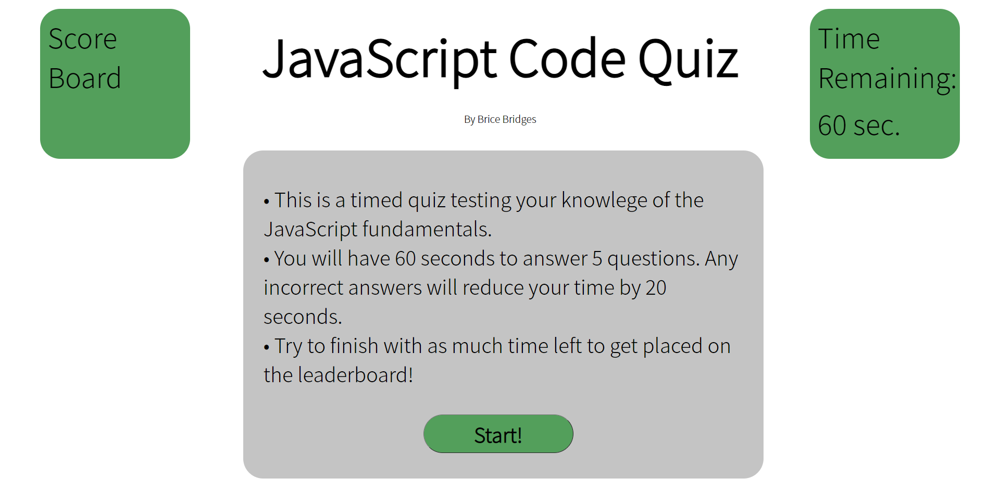

# [JavaScript-Coding-Quiz](https://bcbridges.github.io/JavaScript-Coding-Quiz/) Website

## Description of Project

This quiz was created to practice developing a website using 'vanilla' HTML, CSS, and JavaScript. Designing the quiz used various DOM traversing methods to de-populate and re-populate the web page with the appropriate information. Event listeners were used to navigate the user through the quiz to the correct section based on various time and question # criteria.

### index.html

- The html was designed to be containers for the JavaScript to insert content into.
- The home page content of the quiz is marked up into the html, but is hidden once the game begins.

### style.css

- The style.css was used to create rulesets that could be used more universally across the multiple types of elements that are created and inserted during the game.

### script.js

- The script is written in 'vanilla' JavaScript without the aide of jQuery.
- The questions were stored internally using nested object properties.
- There were a total of 5 event listeners and 5 functions defined outside of those events.

## Acknowledged Bugs

- When the 'Score Board' button is clicked repeatedly, the generated list items will multiply. When the user goes 'Back to game', then these additional list items are removed when the 'Score Board' is re-entered.

## Installation and Access

There is no required software installation necessary to access the code or GitHub published webpage. To access the webpage, either click the 'JavaScript-Coding-Quiz' link at the top of this readme or go to this link https://bcbridges.github.io/JavaScript-Coding-Quiz/.

To begin the quiz, click the 'Start!' button located at the bottom of the page (see Image 1). You will then be brought through 5 questions to answer regarding JavaScript basics. The game will end when you answer all questions or the time runs out. For each incorrect question, the timer will be reduced by 20 seconds.

### Image 1

The index.html can be accessed [here](index.html), the style.css [here](./assets/style.css), and the script.js [here](./assets/script.js).

## License

Copyright (C) 2021 Brice Bridges - the full license can be viewed [here](license.txt)
